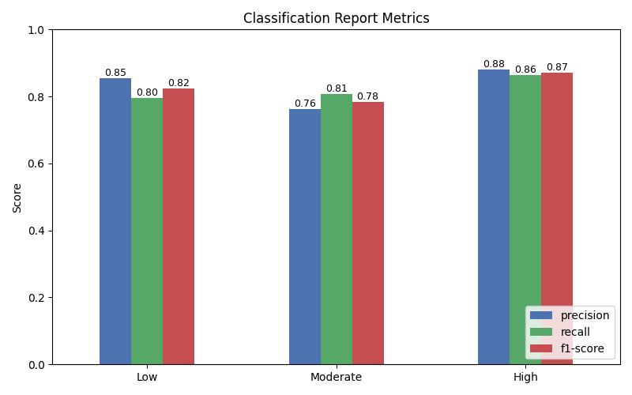

# Student Stress Level Classifier

A machine learning project that examines the habits of students with the goal of gaining insight into how their daily routines may affect their stress levels. Habits such as studying, extracurricular involvement, sleep, socialization, and physical activity, as well as performance indicators like GPA, are analyzed to understand their correlation with stress.

---

## Goal

The main goal of this project is to predict a student's stress level, categorized as low, moderate or high, depending on their times spent on different activities and academic performance. By providing clarity on the factors that most influence stress, the project aims to give students actionable context for developing less stressful lifestyles without compromising academic success.

---

## Dataset

The dataset used in this project was sources from [Kaggle](https://www.kaggle.com/datasets/afnansaifafnan/study-habits-and-activities-of-students), containing information about time spent on daily activities, academic performance, and reported stress level. Each entry has figures like time spent studying, sleeping, exersizing, socializing, and participating in extracurricular activities, as well as GPA.

The target variable is the **stress level**, indicated as *low*, *moderate* or *high*. These features will allow us to explore the correlation between lifestyle patterns, academic performance and stress. They will also help us build a predictive model capable of identifying which habits most strongly influence stress.

---

## Exploratory Data Anaysis

**Key Insights:**
- Students who study more are more likely to have a higher GPA and more stress.
- Physical activity has a negative correlation with other activities, one being study and therefore stress.
- Students who sleep more were less likely to be very stressed.
- Some outliers were observed and will be need to be removed before training for more accurate results.

**Figures:**

---

## Data Preprocessing

No missing values or duplicate rows were found in the dataset. Outliers in numeric features were identified using the interquartile range (IQR) method and removed before training. This helps reduce the impact of extreme values and can improve model performance.

---

## Feature Engineering

To improve model performance and reduce redundancy, I performed feature engineering before training:
- **GPA** was removed because it was highly correlated with **study time**, reducing redundant information and potential multicollinearity.
- Features such as **extracurricular activity time** and **social time** were removed due to low predictive importance, minimizing noise and helping the model focus on the most relevant factors.

---

## Modeling

This model was made using **logistic regression**, it works well in this situation because it models the probability of each class based on the input features, making it effective for categorical outcomes. After experimenting with different hyperparameter settings, including various solvers and iteration limits, I found that removing them entirely did not noticeably change the model's performance, indicating that the default configuration worked well enough for this purpose.

---

## Results

To ensure better results, the model was trained and evaluated using 1,000 different random seeds for splitting the training and test data. Across all samples, the model scored an accuracy of **82.6%**, indicating strong performance. 

As shown in the confusion matrix, each classification yielded slightly different results. The **high stress** students were the most identifiable, with **precision, recall, and F1-scores all above 86%**. The **moderate stress** group was the most challenging to predict, though still produced reasonable scores. This is somewhat expected, as students in the moderate category often displayed activity patterns that blended characteristics of both high and low stress groups, making them more prone to being categorized as on the extremes.

Also, because stress is a subjective measurement, some inconsistency in labeling is expected. Students who appear to belong to one stress category based on their activities might self-report differently due to personal coping mechanisms or varying perceptions of what "stress" means to them. This subjectivity likely contributes to occasional misclassifications, even when the model's performance is otherwise strong.

