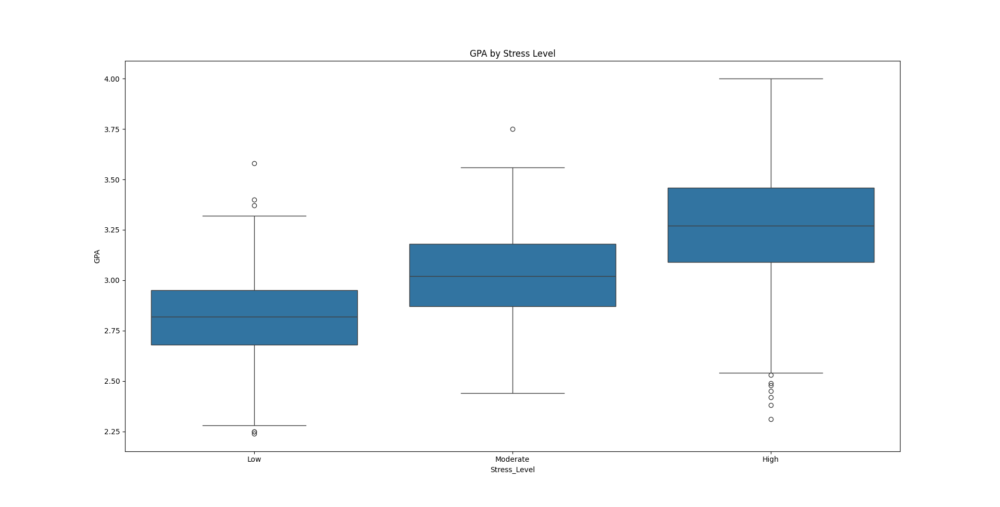

# Student Habits and Stress Prediction Analysis

A machine learning project that examines the habits of students with the goal of gaining insight into how their daily routines may affect their stress levels. Habits such as studying, extracurricular involvement, sleep, socialization, and physical activity, as well as performance indicators like GPA, are analyzed to understand their correlation with stress.

---

## Goal

The main goal of this project is to predict a student's stress level, categorized as low, moderate or high, depending on their times spent on different activities and academic performance. By providing clarity on the factors that most influence stress, the project aims to give students actionable context for developing less stressful lifestyles without compromising academic success.

---

## Dataset

The dataset used in this project was sources from [Kaggle](https://www.kaggle.com/datasets/afnansaifafnan/study-habits-and-activities-of-students), containing information about time spent on daily activities, academic performance, and reported stress level. Each entry has figures like time spent studying, sleeping, exersizing, socializing, and participating in extracurricular activities, as well as GPA.

The target variable is the **stress level**, indicated as *low*, *moderate* or *high*. These features will allow us to explore the correlation between lifestyle patterns, academic performance and stress. They will also help us build a predictive model capable of identifying which habits most strongly influence stress.

---

## Exploratory Data Anaysis

**Key Insights:**
- Students who study more are more likely to have a higher GPA and more stress.
- Physical activity has a negative correlation with other activities, one being study and therefore stress.
- Students who sleep more were less likely to be very stressed.
- No extreme outliers were observed.

**Figures:**

